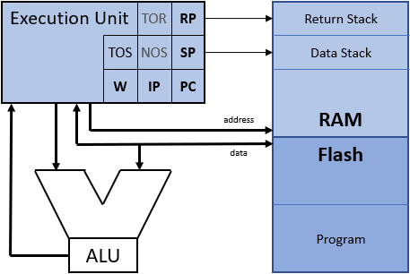

# mcForth
A FORTH for microcontroller with or without flash memory.

## Concept
This Forth based on a typical Forth processor with following structure:

There are some registers who are used in Forth:
- PC = Program Counter - points to the actual program im Flash or RAM
- SP = Data Stack Pointer - points to top of stack (maybe separate memory)
- RP = Return Stack Pointer - points to top of return stack (also maybe separate memory)
- TOS = Top of Stack - latest entry on data stack is often in a register or part of ALU
- NOS = Next of Stack - second entry on data stack can be register or in data stack memory
- TOR = Top of Returnstack - latest entry on return stack can be register or in return stack memory
- IP = Instruction pointer - used in indirect threaded Forth version who need a separate Forth instruction pointer
- W = Working register - used in indirect threaded Forth version an points to the data part of a Forth word

The memory used by Forth can be on RAM area or divided into Flash and RAM.
The RAM is used for variable, maybe program, heap, and maybe data and return stack.
The Forth program in microcontroller is saved in Flash.
The main problem using flash in microcontroller is the size of erasable and programable areas.
For example on a XMC1100 microcontroller you can only erase blocks of 256 byte and you have to program 16 byte at once because ECC.
So mcForth use a RAM buffer of at least 512 byte to keep new program part during compilation.
Also it use two separate links for the words in Flash and in RAM.
More about this you will find in the mcForth user manual.

The first implementation of mcForth use MASM to realize a VP32 (Virtual Processor with 32-bit data size) in 386 assembler.
This mcFSimVP32.exe program execute the ...mcf-File with mcForth or application.
Because I want to support different Forth threaded modes and RAM or RAM/Flash version there are some options available.

## RISC-V
Here are the sources for my RISC-V assembler, disassembler, and simulator realized in mcForth.

## EdWin - an editor for screen and seq. files with markdown in Forth
This is part of mcForth (mcFEdWin.f) but also available for Gforth (GforthEdWin.f).

Please check also mcforth.net with the actual program version and some description in German.

Regards,
Klaus Kohl-Schoepe.
